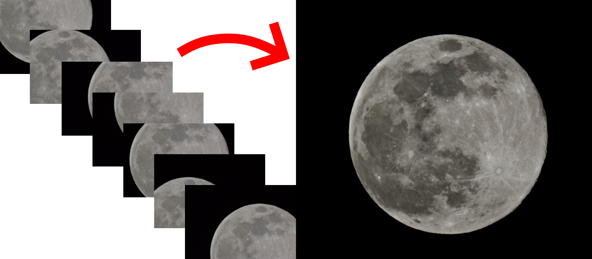

# Strata

Strata is an image merging application intended for astrophotography.

## Download

[Download the latest version here.](https://github.com/fabianboesiger/strata/releases/tag/0.1.0)

## Compilation

Use `cargo build --features gui --release` to compile the application by yourself.

On Linux, you may have to install some packages in order to get [iced](https://github.com/hecrj/iced) working.

## How it Works

1. **Loading images.**
   1. Enter the path to the directory that contains the images.
   2. Strata will load the images for further processing.
2. **Find positions of the images relative to each other.**
   1. Strata calculates the relative positions of all images pairwise by finding the position such that the intersecting subimage difference is minimal.
   2. The images and relative positions to each other now form a complete graph.
   3. Strata computes the minimum spanning tree using Kruskal's algorithm which uniquely determines the position of each image.
3. **Adjusting the brightness.**
   1. Strata automatically adjusts the brightness.
5. **Joining the images.**
   1. Strata joins the image into a single image.
7. **Saving the resulting image.**
